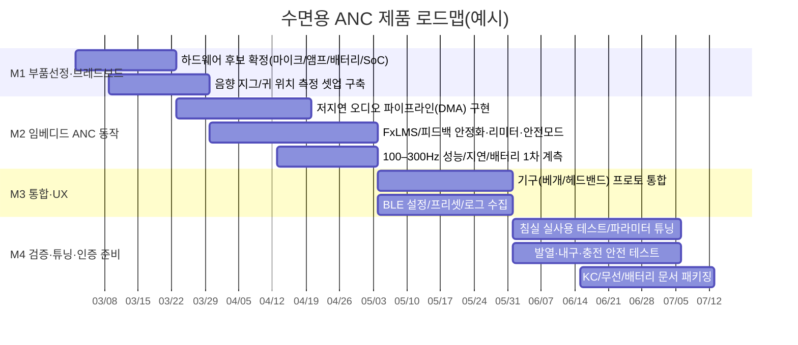

# 제품화 가능한 수면용 ANC 제품 심층 조사 보고서

## Executive summary

본 보고서는 **“사용자가 잠을 편안하게 지속할 수 있는 수면용 소음 저감 제품”**을, 스피커형·베개형·착용형(이어버드/헤드밴드 등)으로 나누어 **사용자 경험(UX)·제품 종류·기술 구현 가능성** 관점에서 실무적으로 평가한다. 기준 성능은 사용자가 제시한 목표(귀 위치 기준 **100–300 Hz에서 10–15 dB**, 지연 **≤5 ms**, 배터리 **≥6시간**, 안전한 SPL 리미터, 발열·내구 신뢰성)이며, 특히 **코골이의 주요 에너지가 저주파(100–300 Hz 대역)**에 집중된다는 점을 전제로 한다. 실제 연구에서도 코골이 신호의 저주파 집중(예: 흡기 100–200 Hz, 호기 200–300 Hz)과 “삭제해야 할 기본 주파수(100–300 Hz)”를 명확히 언급한다. citeturn5view0 또한 임상·음향 연구에서 코골이 기본 주파수(예: 구개성 코골이 약 100 Hz 등) 및 저주파 밴드 분류(예: 40–300 Hz)를 확인할 수 있다. citeturn1search0turn1search23

시장 관점에서, 수면용 제품은 역사적으로 **진정한 ANC(마이크+역상음 생성)보다 “노이즈 마스킹/패시브 차음”을 주류로 택해왔고**, 대표적으로 entity["company","Bose","audio company"] Sleepbuds II는 “수면에는 소리를 ‘지우기’보다 ‘덮는’ 노이즈 마스킹이 더 낫다”는 제품 철학을 공식 발표했다. citeturn13view4 다만 최근에는 entity["company","Anker","consumer electronics company"] 산하 entity["company","soundcore","anker audio brand"] Sleep A30/A30 Special처럼 **수면 전용 이어버드에 ANC를 실제 탑재**하고(“Triple Noise Reduction”, ANC+패시브+코골이 적응 마스킹), 배터리·착용감까지 수면 시나리오에 맞춘 상용 제품이 등장해 카테고리가 확장되는 중이다. citeturn13view0turn4news40turn12news39

기술 관점 결론은 다음과 같다.  
(1) **착용형(특히 인이어)**은 귀-스피커 경로가 짧고 누설/모델링이 유리해 목표(100–300 Hz 10–15 dB)에 가장 근접한다는 근거가 강하다(상용 ANC 이어버드가 저주파에서 20–30 dB 수준의 감쇠를 보일 수 있다는 측정/리뷰 근거 포함). citeturn12search0turn12search11turn12search13  
(2) **비착용형(베개 내장/스피커형)**은 사용자 편안함 측면에서 매력적이지만, **“국소(ear-zone) ANC”** 문제로 귀 위치 변화·자세 변화에 취약하며, 성능을 확보하려면 스피커/마이크 배치·가상 센싱·포즈 추정(또는 다채널 여유) 같은 복잡도가 증가한다. 다만 **‘ANC 베개’가 실험적으로 가능**하다는 Applied Acoustics(2022) 연구(베개 내부 2개 스피커, 에러 마이크를 스피커에서 3 cm 배치, 100–400 Hz 협대역 소음 실험 등)가 있어, 제품화는 “불가능”이 아니라 **R&D 난이도가 높은 트랙**으로 보는 것이 타당하다. citeturn15view0  
(3) “지연 ≤5 ms”는 오디오 제품에서는 충분히 달성 가능한 수치처럼 보이지만, ANC는 **“인과성(causality) 제약”**과 **ADC/DAC 지연** 때문에 예측 제어가 필요해질 수 있다는 점이 문헌적으로 지적된다(헤드폰 디지털 ANC에서 컨버터 지연 때문에 소음 예측이 필요하다는 논의). citeturn1search22 따라서 제품 목표를 “지연 5 ms”로만 두기보다, **실제 배치에서 ‘참조 마이크가 소음을 얼마나 먼저 보느냐(시간 선행)’**까지 포함해 시스템 레벨로 재정의해야 한다.

종합 추천은 **2~3개 콘셉트를 병렬로 두고 M1~M2에서 빠르게 ‘성능/편안함/배터리’의 현실치를 계측**하여 승자 트랙을 정하는 전략이다. 상용 경쟁·규제·제조를 고려하면 “착용형 인이어(또는 초저프로파일 귀옆 모듈)”이 상업화 확률이 높고, “베개형 국소 ANC”는 차별화 폭이 크지만 기술 리스크가 크다. citeturn13view0turn15view0turn2search18

## 시장 및 제품 지형

수면용 소음 저감 제품은 대체로 **(가) 패시브 차음 + 노이즈 마스킹**, **(나) 패시브 + ANC(저주파)**, **(다) 비착용형 스피커(베개 스피커/본컨덕션/화이트노이즈 머신)**로 나뉜다. 상용 흐름을 보면 “완전 소거(ANC)”보다 “사용자가 불편 없이 장시간 착용/사용”하는 게 더 중요해, 마스킹 중심이 오랫동안 우세했으나(예: Sleepbuds II), 수면 전용 ANC 이어버드가 최근 등장했다. citeturn13view4turn13view0turn12news39

아래 이미지는 이해를 돕기 위한 “제품 유형별 대표 형태” 예시다(브랜드/모델은 예시이며, 실제 성능은 착용/실측 조건에 따라 달라진다).  

image_group{"layout":"carousel","aspect_ratio":"1:1","query":["soundcore Sleep A30 sleep earbuds","Bose Sleepbuds II noise masking earbuds","QuietOn 3.1 sleep earbuds","SleepPhones headband sleep headphones"],"num_per_query":1}

대표 상용 카테고리의 특징은 다음과 같다.

첫째, **노이즈 마스킹 기반 수면 이어버드**는 “소리를 덮어서 인지 방해를 줄이는” 방향이며, entity["company","Ozlo","sleep earbuds company"] Sleepbuds는 블루투스 스트리밍/바이오 센싱/10시간 배터리 등을 전면에 내세우되, 핵심은 “noise masking” 계열의 사용자 가치(수면용 음원·개인 알람·센서)다. citeturn13view2turn6search6 또한 Sleepbuds II도 노이즈 마스킹을 “수면에 더 적합”하다고 명시하고, 안전·인지(알람/경보) 이슈를 매뉴얼에서 직접 경고한다. citeturn13view4turn5view1

둘째, **수면 전용 ANC 이어버드**는 저주파(코골이·팬·교통 저역) 감쇠를 겨냥한다. Sleep A30/A30 Special은 “ANC Engineered for Sleep”, “Triple Noise Reduction System”을 표방하며, 배터리·착용감(약 3g, 사이드 슬리퍼 고려), 사용 시나리오별 배터리(예: 8~10h/케이스 포함 수일)까지 구체적으로 제시한다. citeturn13view0turn13view1turn4news40 한국어권에서도 “수면용 ANC 이어폰” 관점의 체험기/리뷰가 공개되어(예: 조선비즈 체험기), 실제 구매자의 기대가 “코골이/생활 저역 소음”에 맞춰져 있음을 확인할 수 있다(다만 개별 후기의 일반화에는 주의). citeturn7search1

셋째, **비착용형(베개/스피커형)**은 “귀에 아무것도 넣지 않는” 편안함이 장점이지만, 대다수는 ANC가 아니라 “베개 스피커/본컨덕션/마스킹”에 머문다(예: 베개 아래에 넣는 초박형 스피커류). citeturn14search13turn14search30 그러나 연구 문헌에서는 “ANC 베개/헤드레스트”처럼 귀 주변에 국소적인 quiet zone을 만드는 시도가 꾸준히 있어, 제품 차별화 여지는 존재한다. citeturn15view0turn2search18

넷째, **일반 TWS ANC(통근/여행용)**는 저주파 감쇠 성능이 강하나(측정 사례 다수), 수면 착용성(특히 옆으로 눕는 자세)과 장시간 착용 안정성이 핵심 리스크다. 예컨대 리뷰 기반으로도 “100–300 Hz 대역에서 일관된 ANC 효과”가 언급되는 제품군이 존재하지만, 이는 수면 전용 폼팩터/저프로파일과는 별개 문제다. citeturn12search11turn12search16

## 기술 구현 관점: 목표 스펙의 물리·DSP 제약

### 코골이(100–300 Hz)와 “국소 ANC” 문제

코골이는 연구에서 저주파 성분이 지배적이며(예: 흡기 100–200 Hz, 호기 200–300 Hz), “제거해야 할 기본 주파수”가 100–300 Hz에 위치한다는 기술적 서술이 있다. citeturn5view0 다른 임상/음향 연구들도 코골이의 기본 주파수(예: 약 100 Hz) 및 저주파 밴드(40–300 Hz 등)를 보고한다. citeturn1search0turn1search23

이 대역은 파장이 길어(100 Hz는 약 3.4 m), **방 전체 소거는 사실상 불가능에 가깝고**, “귀 근처의 작은 공간(quiet zone)”을 목표로 하는 국소 ANC가 설계 타깃이 된다. 국소 ANC는 문헌에서 “글로벌 제어는 대략 300 Hz 이하에서 잘 작동한다”는 논의와 함께, **머리 움직임을 추적해 최대 약 1 kHz까지 제어 대역을 확장**하는 연구까지 보고된다. citeturn2search18turn14search27

### FxLMS 계열과 지연(≤5 ms)의 재정의

실무적으로 다채널/국소 ANC에서 **FxLMS(Filtered-x LMS)** 계열은 표준적 선택이며(secondary path 모델을 포함), 튜토리얼 리뷰와 이후의 많은 연구들이 이를 기반으로 한다. citeturn1search10turn1search2 또한 코골이처럼 **비정상(non-stationary)**이고 “간헐적으로 신호가 사라지는” 소음은 적응 알고리즘에 불리할 수 있어, 코골이 활동 검출(SAD)을 결합해 안정성을 높이는 연구 흐름이 존재한다. citeturn5view0

여기서 사용자가 제시한 “총 지연 5 ms 이하”는 제품 요구로는 합리적이지만, ANC에서는 단순히 **DSP 처리 지연**만이 아니라,
- 참조 마이크가 소음을 얼마나 “먼저” 보느냐(소음원-귀 거리 vs 소음원-참조마이크 거리)
- ADC/DAC, I2S, 프레임 크기, 필터 길이에 따른 시스템 그룹지연
- 스피커-귀 사이 음향 전파 지연  
이 합쳐져 인과성/성능을 좌우한다.

특히 헤드폰의 디지털 ANC 문헌에서는 **일반적인 오디오 컨버터 지연 때문에 ‘소음을 예측해야 한다’**는 접근을 다룬다. citeturn1search22 결론적으로 “≤5 ms”는 목표로 두되, **배치별(이어버드/베개/스피커형) 인과성 마진을 실제로 계측**해 평가해야 한다.

### ANC 베개/헤드레스트 문헌이 주는 현실적 시사점

Applied Acoustics(2022)에서는 **휴대 가능한 ANC 베개**를 구현하며, 두 개의 3인치 스피커를 베개 내부에 두고, 에러 마이크를 스피커로부터 3 cm 위치에 배치했다고 소개한다. 또한 45 cm 떨어진 1차 소음원에서 100–400 Hz 협대역(지배 톤 200 Hz) 소음을 입력으로 실험하는 등, “베개 기반 ANC”가 연구적으로는 성립함을 보여준다. citeturn15view0 동시에 이 논문은 **피드포워드 구조의 ‘참조 센서 위치 선정’이 환경 변화에서 인과성을 만족시키기 어렵다**는 점, 피드백 구조는 대역폭·워터베드 효과(특정 대역 감쇠의 대가로 다른 대역 증폭 가능) 이슈가 있다는 점도 명확히 지적한다. citeturn15view0

즉 제품화 관점에서는,
- 베개형/스피커형은 “편안함”을 얻는 대신 “국소 ANC 유지(자세 변화/움직임)”가 핵심 난제
- 착용형은 “국소성 유지”가 쉬운 대신 “장시간 착용 UX”가 핵심 난제  
로 문제 중심이 갈린다.

### 근접 스피커에서의 SPL·전력 감(계산 결과)

아래 그래프는 “귀 근처 스피커”에서 목표 SPL을 만들 때 필요한 전력의 **거친 감**을 보여준다. 가정은 (i) 소형 드라이버 감도 80 dB SPL @1W/1m, (ii) 자유음장 거리감쇠이며, 실제 베개 내부 공진/누설/저역 효율은 반영하지 않았다(따라서 제품 설계 시에는 **여유 전력**을 반드시 둬야 한다).


배터리 6시간 목표는 평균 소비전력 설계(저전력 마이크/DSP/앰프, 수면 중 동작 모드 전환)에 따라 달성 난이도가 크게 달라진다. 아래는 3.7V 1셀 기준, 효율 85% 가정의 런타임 추정이다.


상용 사례에서도 수면 전용 이어버드는 “ANC/스트리밍 여부”에 따라 배터리 지속이 크게 갈리며, 예를 들어 Sleep A30은 사용 시나리오별로 수 시간~수십 시간(로컬 재생/ANC OFF 등)까지 차이를 공식 표기한다. citeturn13view0turn13view1

## 제품 유형별 비교

아래 표는 “제품 유형” 단위로, 목표 스펙(100–300 Hz 10–15 dB, ≤5 ms, ≥6h) 달성 가능성과 제품화 리스크를 비교한 것이다. 비용(BOM)은 공개된 테어다운이 없는 영역이 많아, **“대략적인 제조 BOM 범위(부품·배터리·기구 포함, 대량 전제)”**로 추정했으며, 실측과 공급망(특히 모듈 가격 변동)에 따라 크게 달라질 수 있다(예: 컴퓨팅 모듈의 가격 인상/불안정 이슈). citeturn9news40

| 제품 유형 | 상용/근접 사례(예) | 100–300 Hz 10–15 dB 목표 | ≤5 ms 설계 난이도 | ≥6h 배터리 | 착용성/편안함 | 안전/신뢰성 이슈 | 대략 BOM 범위(추정) | 성공 확률(제품화) |
|---|---|---|---|---|---|---|---|---|
| 인이어 수면 전용(ANC 포함) | Sleep A30/A30 Special citeturn13view0turn4news40 | **높음**: 저주파 수면 방해원에 초점, 실측/리뷰에서 저역 성능 언급 citeturn12search13turn12search9 | **중간**: 내부 DSP는 가능, 다만 예측/안정화 설계 필요 citeturn1search22 | **중간~높음**: 시나리오별 6~10h 표기 citeturn13view0turn13view1 | **중간**: 사이드 슬리퍼 최적화(저프로파일)가 관건 citeturn13view0 | 귀 건강(염증/압박), 알람 인지 저하 우려(마스킹/차음 공통) citeturn5view1 | 40–80 USD | **높음**(시장 검증 진행 중) citeturn12news39turn7search1 |
| 인이어 수면 전용(노이즈 마스킹 중심) | Sleepbuds II, Ozlo Sleepbuds citeturn13view4turn13view2 | **중간**: “상쇄”가 아닌 “인지적 덮기”가 중심(저역 완전 감쇠는 제한) citeturn13view4 | 해당 없음(ANC 미탑재 또는 제한적) | **높음**: 10h 수준 스펙 표기 사례 citeturn13view4turn13view2 | **높음**: 수면 착용에 특화된 저프로파일 설계 강조 citeturn13view4turn13view2 | “주변 경보/알람 인지” 경고·가이드 필요 citeturn5view1 | 30–70 USD | **높음**(수면 시장에서 검증됨) citeturn13view4turn6search6 |
| 일반 TWS ANC(통근형) | AirPods Pro 계열, WF-1000X 계열(측정 상 저역 강점) citeturn12search11turn12search16 | **높음**(성능만 보면): 저역에서 큰 감쇠 보고 citeturn12search0turn12search11 | **중간**(내장 DSP) | **중간**: 스펙상 6~8h급 흔함 citeturn0search12turn0search15 | **낮음~중간**: 옆으로 눕기 압박/탈락 가능 | 수면 중 탈락, 피부 압박, 케어(세정) | 35–90 USD | **중간**(수면 UX가 병목) |
| 헤드밴드/수면 마스크(평면 스피커) | SleepPhones 등(대개 ANC 없음) citeturn13view3turn2news42 | **낮음**(ANC 미탑재가 일반) | 해당 없음(또는 개발 시 중간~높음) | **높음**: 12h+ 주장 사례 존재 citeturn2search13turn2news42 | **중간~높음**: “귀 안에 넣지 않음” | 땀/세탁/내구 설계 중요 citeturn13view3 | 15–50 USD(ANC 없을 때) | **중간**(마스킹 제품으로는 높음, ANC는 별도 R&D) |
| 베개형 국소 ANC(베개 내부 스피커+에러 마이크) | 연구 기반 ANC pillow citeturn15view0 | **중간**: 100–300 Hz에 이론적 적합, 단 자세 변화·워터베드 리스크 citeturn15view0turn2search18 | **높음**: 인과성/자세 변화 대응이 핵심 | **높음**(배터리 공간 여유) | **높음**: “비착용” | 발열·세탁/방수·EMC, 내부 공진/진동 | 60–140 USD | **중간**(차별화는 크나 난이도↑) |
| 스피커형(베개 아래/침대 옆) 마스킹 | 베개 스피커/화이트노이즈류 citeturn14search13turn14search7 | **낮음**(상쇄가 아닌 전달/마스킹) | 해당 없음 | **높음**(유선/대형 배터리 가능) | **높음** | 동거인 방해, 음질 왜곡(베개가 필터) citeturn14search30 | 10–35 USD | **높음**(단, “ANC” 가치 제안은 어려움) |

표가 시사하는 바는 명확하다. 사용자가 목표로 하는 “100–300 Hz 실제 감쇠(10–15 dB)”를 **제품의 핵심 가치로 내걸려면**, 상용 검증이 가장 강한 축은 **착용형(특히 인이어)**이며, 비착용형은 연구 가능성은 있으나 제품화 난이도가 높다. citeturn12search13turn15view0

## 추천 콘셉트

아래 3개 콘셉트는 “사용자 목표(코골이 100–300 Hz 감쇠, ≤5 ms, ≥6h, 편안함, 안전 리미팅, 신뢰성)”에 맞춰, **현실적인 상용화 경로**와 **차별화 가능성**을 균형 있게 배치했다. (블록 다이어그램은 이해용이며, 실제 구현에서는 채널 수/필터 길이/프레임 크기에 따라 달라진다.)

**콘셉트 A: 베개 내장형 ‘귀 옆’ 국소 ANC 모듈(비착용, 단일 사용자 최적화)**  
핵심은 “베개 밑 전달”이 아니라, 연구 ANC pillow처럼 **베개 내부에 스피커를 두되 에러 마이크를 귀 근처/스피커 근접(수 cm)으로 배치**해 국소 quiet zone을 만드는 것이다. citeturn15view0 이 방식은 사용자 착용 부담이 거의 없고, 제품 차별화가 크다. 반면 자세 변화에 대한 내성이 병목이므로, (i) 좌/우 다채널 여유, (ii) 캘리브레이션/프리셋, (iii) 간단한 “머리 위치 감지(압력/IMU)” 중 하나를 넣는 것을 권한다(헤드레스트 연구에서도 head tracking/센싱으로 성능 저하를 보완하는 흐름이 있다). citeturn2search18turn15view0

```mermaid
flowchart LR
  RM[Reference Mic(베개 전면/소음원 방향)] --> DSP[FxLMS/Feedback+Feedforward 혼합]
  EM_L[Error Mic L(귀 옆/근접)] --> DSP
  EM_R[Error Mic R(귀 옆/근접)] --> DSP
  DSP --> AMP_L[Class-D Amp L] --> SPK_L[Speaker L(베개 내부)]
  DSP --> AMP_R[Class-D Amp R] --> SPK_R[Speaker R(베개 내부)]
  SPK_L --> EM_L
  SPK_R --> EM_R
  BLE[BLE 설정/업데이트] --> DSP
  PWR[배터리/PMIC/충전] --> DSP
  PWR --> AMP_L
  PWR --> AMP_R
```

- 마이크/스피커 배치: 스피커는 좌/우 2채널(필요 시 4채널로 확장), 에러 마이크는 귀 옆(또는 귀가 닿는 베개 측면의 음향 구멍)으로 “가능한 한 일관된 위치”를 확보. 연구 사례는 3 cm 근접 배치를 언급한다. citeturn15view0  
- 핵심 부품 후보(예시):  
  - MCU/DSP: entity["company","STMicroelectronics","semiconductor company"] STM32H7 계열(최대 480 MHz, 메모리/전력 효율 옵션) citeturn9search0turn9search4  
  - 대안(개발 편의): entity["company","Raspberry Pi Ltd","single-board computer company"] Compute Module 4(무선 모듈 옵션 포함) citeturn9search1turn9search9 단, 최근 메모리 수급에 따른 가격 인상 등 공급망 리스크를 비용 모델에 반영해야 한다. citeturn9news40  
  - I2S 디지털 마이크: entity["company","TDK InvenSense","MEMS sensor maker"] ICS-43432(I²S 인터페이스, 65 dBA SNR, ±1 dB 감도 공차 등) citeturn10search0  
  - Amp: MAX98357A 계열(I2S 입력 Class-D, 소형·저전력 설계에 널리 사용) citeturn9search3  
  - BLE SoC(설정/업데이트용): entity["company","Nordic Semiconductor","wireless SoC maker"] nRF52840(멀티프로토콜 BLE 등) citeturn10search2  
  - 충전/파워패스: entity["company","Texas Instruments","semiconductor company"] BQ24074(1셀 리튬 충전+파워패스 계열) citeturn10search3  
- 예상 성능/리스크:  
  - 100–300 Hz는 국소 제어 타깃으로 적합하나, **자세 변화(머리 이동/압력)로 secondary path가 흔들리면 성능이 급락**할 수 있다(헤드레스트/베개 연구의 공통 난제). citeturn2search18turn15view0  
  - 피드백 구조는 워터베드 효과로 “일부 대역 증폭”이 발생할 수 있어, **리미터+대역 제한+안전 모드**가 필수다. citeturn15view0  
- BOM(추정): 60–140 USD(SoC 선택, 채널 수, 배터리 용량, 기구/흡음재에 따라 변동).  

**콘셉트 B: 인이어 수면 전용 ANC 이어버드(‘상용 검증 경로’ 최우선)**  
“제품화 성공확률”만 보면 가장 우세한 트랙이다. 시장에서 수면 전용 ANC 이어버드가 이미 판매되고, “코골이/저주파 방해원”을 핵심 가치로 마케팅하며, 체험기·리뷰 데이터를 축적 중이다. citeturn13view0turn12news39turn7search1 특히 수면 전용 제품은 **저프로파일(사이드 슬리퍼 압박 최소화)**, **배터리(수면 1회 이상)**, **수면 감지 후 모드 전환(스트리밍 OFF/로컬 재생)** 같은 UX 설계가 제품 스펙에 직접 반영된다. citeturn13view0turn13view1

```mermaid
flowchart LR
  Mic_FF[Feedforward Mic(외부)] --> DSP[ANC DSP + 적응/예측]
  Mic_FB[Feedback Mic(이어캐널)] --> DSP
  DSP --> DACAMP[DAC/코덱+Amp] --> Driver[In-ear Driver]
  DSP --> Limiter[SPL 리미터/안전] --> DACAMP
  IMU[IMU/수면감지] --> DSP
  BLE[BLE/앱] --> DSP
  Batt[초소형 배터리] --> DSP
  Batt --> DACAMP
```

- 마이크/스피커 배치: 이어캐널(피드백) + 외부(피드포워드) 조합이 상용 ANC의 전형이며, 저주파 성능을 좌우한다(상용 제품 설명에서도 내부/외부 마이크 기반 ANC를 강조). citeturn12news39  
- 예상 성능: 저주파에서 10–15 dB는 “충분히 커버 가능한 목표”로 보는 근거가 강하다(예: 상용 ANC 이어버드가 주파수에 따라 20–30 dB 수준의 감쇠 가능하다는 측정 기반 설명, 100–300 Hz 대역에서의 일관성 개선 언급). citeturn12search0turn12search11 다만 수면 환경에서는 “귀 팁 씰/압박”이 성능과 트레이드오프이며, 코골이는 비정상 소음이므로 **ANC 단독보다 ‘코골이 마스킹’과 결합**되는 것이 상용 트렌드다. citeturn13view0turn12search13  
- 배터리: 수면용은 “ANC+블루투스 스트리밍”만으로 8시간을 안정적으로 채우기 어렵다는 리뷰도 존재하므로(테스트에서 7.5h 수준), **수면 감지 후 스트리밍 종료/로컬 재생** 같은 전략이 유효하다. citeturn4search24turn13view0  
- 리스크: 초소형 RF/음향/배터리/안테나/방수(IPX)·생산수율·AS까지 포함한 제조 난이도가 매우 높다(스타트업 초기 제품으로는 리소스 부담).  

**콘셉트 C: 헤드밴드형 ‘귀옆 스피커+마이크’ 국소 ANC(착용형이지만 인이어 회피)**  
인이어의 압박·위생 리스크를 피하면서, 귀 근처에 스피커를 고정해 국소 제어를 가능하게 하는 중간 트랙이다. 기존 헤드밴드형 수면 헤드폰은 대체로 ANC가 없고(마스킹 중심), 스피커 위치가 움직여 사용 중 재정렬이 필요하다는 지적이 있어, ANC까지 넣으려면 “고정성” 설계가 중요하다. citeturn2search13turn13view3

```mermaid
flowchart LR
  Ref[Reference Mic(머리 측면/전면)] --> DSP[FxLMS/하이브리드 ANC]
  ErrL[Error Mic L(귀 앞/근접)] --> DSP
  ErrR[Error Mic R(귀 앞/근접)] --> DSP
  DSP --> AmpL --> SpkL[Flat Speaker L]
  DSP --> AmpR --> SpkR[Flat Speaker R]
  Batt --> DSP
  Batt --> AmpL
  Batt --> AmpR
  BLE --> DSP
```

- 장점: 인이어 대비 이물감/염증 리스크를 낮추면서, “귀 근처”라는 ANC 유리 조건을 유지.  
- 단점: 옆으로 누울 때 헤드밴드가 뜨거워지거나(열/땀), 압박점이 생길 수 있고, 스피커 위치가 미세하게 이동하면 보정이 필요(UX 병목). citeturn2news42turn13view3  
- 제품화 포지션: “완전 ANC”보다는 **저주파 약감쇠 + 마스킹 + 착용감**을 함께 파는 상품성이 현실적.

## UX 고려사항

수면 제품 UX는 “소음 저감 성능”만큼이나 **불편함 없이 ‘계속 착용/사용’**이 핵심 KPI다. 상용 수면 이어버드들도 착용감(저프로파일, 사이드 슬리퍼)과 수면 모드 자동 전환(재생/알림/연결)을 스펙 전면에 둔다. citeturn13view0turn13view1

첫째, **착용감·압박·열**. 인이어는 옆으로 눕는 압박이 가장 큰 이탈 요인이고, 헤드밴드는 열/땀/밴드 압박이 이탈 요인이다. 사용자가 “한밤중에 깨서 조절해야 하는 경험”은 제품 가치를 급격히 떨어뜨린다(수면 앱/연결/끊김이 불만 포인트가 되는 사용자 피드백이 온라인에 반복적으로 등장). citeturn7search12turn7search23

둘째, **소음 인지와 ‘완전한 침묵’의 역효과**. 일부 사용자는 완전한 침묵에서 이명이 더 도드라진다고 보고하며, 이 때문에 마스킹 선호가 생긴다(커뮤니티 수준의 보고이므로 일반화는 주의하되, 제품 옵션으로 “저역 ANC + 약한 마스킹”을 두는 것이 실무적으로 유리). citeturn7search23

셋째, **안전(알람/경보 인지)**. 수면용 이어버드는 매뉴얼에서 “경보·알람·사람/반려동물 소리 인지가 어려워질 수 있다”는 점을 분명히 경고하고, 볼륨 최소화·한쪽만 착용·타이머 사용 등의 완화책을 제시한다. citeturn5view1 이는 ANC 제품에서도 동일/강화되어야 하며, UX 설계로는 다음이 권장된다.
- “안전 볼륨 상한” 프리셋(수면 중 최대 SPL 제한)
- 특정 이벤트(사용자 음성 호출/알람 감지/가속도 급변) 시 **안전 모드(ANC OFF/볼륨 다운)**
- 초기 설정에서 “알람 중요도” 선택(완전 차음 ↔ 주변 인지) 및 안내 문구 고지

넷째, **설정/운영 UX 최소화**. 수면 제품은 “앱 조작이 불편해지는 순간” 이탈한다. 따라서 기본 동작은 **원버튼/자동**이 이상적이며, BLE 앱은 (i) 펌웨어 업데이트, (ii) 프리셋(수면 자세/베개 높이), (iii) 안전 한계 설정 정도로 제한하는 편이 낫다. 상용 제품도 수면 감지 후 자동 전환을 스펙에 포함한다. citeturn13view0turn13view1

다섯째, **위생/내구/세탁**. 베개형은 “세탁 가능 커버 + 내부 전자모듈 분리”가 필수에 가깝고(침구 사용성), 헤드밴드형도 세탁/땀 대응이 구매 결정을 좌우한다(상용 헤드밴드 제품이 ‘세탁 가능/저자극’을 전면에 둠). citeturn13view3

여섯째, **한국 시장 사용자 행동(추정되는 현실)**. 한국어권 후기에서는 “코골이·층간소음·가전 소음”이 핵심 니즈로 반복되며, 실제 제품 체험기에서도 “막이 씌워져 소음을 막는 느낌” 같은 촉각적 인상이 자주 등장한다(정량 데이터로 연결하려면 자체 사용자 테스트가 필요). citeturn7search1turn7search17

## 검증·테스트·규제·로드맵

### 검증·테스트 계획

**음향 성능 테스트(100–300 Hz 10–15 dB 목표)**  
- 프로토콜: (1) 베이스라인(ANC OFF) 귀 위치 마이크 SPL/스펙트럼 측정, (2) ANC ON 후 동일 조건 측정, (3) 100–300 Hz 대역 평균 감쇠(dB) 및 worst-case(자세 변화) 기록. 코골이는 비정상 신호이므로, 실제 코골이 샘플(녹음) 기반 테스트와 합성 톤/협대역 노이즈 기반 테스트를 병행하는 것이 타당하다. citeturn5view0turn15view0  
- 테스트 환경: 무향/준무향 환경 + 실제 침실(반사/침구 영향) 모두 필요. ANC pillow 연구는 무향실에서 45 cm 거리 소음원을 두고 100–400 Hz 협대역 소음을 사용했다는 구체적 실험 조건을 제공하므로, 초기 벤치마크로 참고 가능하다. citeturn15view0  
- “말소리 인식도 50% 이하”와 같은 지표는 제품 의도에 따라 해석이 갈릴 수 있으므로, 실무적으로는 (a) 알람/경고 인지 보장(안전), (b) 동반자 말소리 필터링(프라이버시/방해 최소화) 중 무엇을 목표로 하는지에 따라 시험 항목을 분리하는 편이 낫다. 수면용 이어버드 매뉴얼에도 ‘주변 인지 저하’가 직접적 안전 항목으로 제시된다. citeturn5view1

**지연 측정(≤5 ms)**  
- 방법: 임펄스(클릭) 또는 MLS 신호를 스피커로 출력하고, 마이크 입력→스피커 출력까지의 시스템 지연(샘플 단위)을 오실로스코프/동기 캡처로 측정. 디지털 ANC에서는 컨버터 지연 때문에 예측 설계가 필요할 수 있다는 문헌 근거가 있으므로, “지연”을 단일 수치가 아니라 “인과성 마진”까지 포함해 기록한다. citeturn1search22

**전원·발열(≥6h, 안전/신뢰성)**  
- 런타임: 대표 시나리오 3종(ANC만, ANC+마스킹, BLE 연결 상태)에서 평균 소모전력과 실제 시간 측정. 상용 수면 이어버드도 모드에 따른 배터리 차이를 상세히 분기한다. citeturn13view0turn13view1  
- 발열: 피부 접촉부(귀 주변/베개 표면) 온도 상승과 충전 중 온도(열폭주 방지) 검증.  
- 내구: 8시간 이상 연속 구동, 반복 충방전, 낙하/압박(수면 중 체중) 시험.

### 규제·인증 체크리스트

한국에서 무선/통신 기능이 있는 제품은 **방송통신기자재 적합성평가(전파법)** 및 KC 마킹 체계의 영향을 받는다. entity["organization","National Radio Research Agency","Korea RRA"]는 적합성평가가 전파법(예: 제58-2조)에 의해 시행되며, 적합성평가 유형(적합인증/등록/잠정인증 등)과 제출 서류 범위를 안내한다. citeturn3search22turn3search18

블루투스 탑재 시에는 법적 전파 인증과 별개로, entity["organization","Bluetooth SIG","bluetooth standards org"]의 Qualification Process를 완료해야 제품에 Bluetooth 상표/로고를 사용할 수 있다는 정책이 공식적으로 명시되어 있다. citeturn4search4turn4search0

배터리는 제품 안전과 물류를 동시에 지배한다. 리튬 배터리는 UN Manual of Tests and Criteria 38.3에 따른 설계 시험(UN 38.3) 및 테스트 서머리 요구가 국제 운송·공급망에서 핵심 요건으로 다뤄진다. citeturn3search7turn3search11

제품 안전 표준은 시장/유통 채널에 따라 다르지만, AV/ICT 장비의 대표 안전 표준으로 IEC 62368-1이 “에너지 기반 위험(based on energy sources)과 안전장치(safeguards)” 관점에서 적용된다는 개요가 표준 문서/해설에 의해 확인된다. citeturn4search5turn4search18

### 안전(SPL 리미터) 기준 설정 방향

수면용 ANC는 “사용자가 장시간 귀 근처에서 소리를 듣는” 구조이므로, 리미터는 기능이 아니라 **인허가·CS·브랜드 리스크를 줄이는 생존 장치**다. entity["organization","World Health Organization","public health agency"]는 안전한 청취 시간/레벨의 관계(예: 80 dB에서 주당 40시간, 90 dB에서 주당 4시간 등)를 설명하며, entity["organization","NIOSH","us public health institute"]도 85 dBA 이상의 노출에 대한 예방을 권고한다. citeturn3search0turn3search12 따라서 제품 정책은 “수면 6–8시간 동안 귀에 직접/근접 음향”이라는 특수 조건을 고려해, **기본 최대 SPL을 보수적으로**(예: 사용자 설정 최대치 제한, 장시간 노출 시 자동 감쇠) 두는 것이 맞다.

### 우선순위 로드맵(M1~M4) 및 일정/리소스

아래는 “콘셉트 A(베개형 국소 ANC) + 콘셉트 B(착용형) 중 승자 선택”을 전제로 한, 실무형 로드맵이다. 핵심은 **M2에서 ‘목표 대역 감쇠(100–300 Hz) + 착용/사용 지속성 + 배터리’의 실측**이 나와야 한다는 점이다(그 전엔 누구도 성공 확률을 정직하게 말하기 어렵다). citeturn5view0turn15view0turn13view0



권장 리소스(최소): 임베디드 2명(실시간 오디오/DSP), 하드웨어 1명(PCB/전원/충전/EMC), 음향 1명(측정/튜닝), 기구 1명(베개 구조/흡음/열), QA/테스트 1명. 베개형(콘셉트 A)은 특히 “기구-음향 상호작용”이 성패를 좌우하므로 음향/기구 리소스 비중을 높이는 것이 안전하다. citeturn15view0turn14search30

### 참고 우선순위 소스

제품/기술 의사결정에서 신뢰도가 높은 순서로 소스를 운영하는 것이 좋다.

가장 우선은 “공식 스펙/매뉴얼/공식 발표”다. 예를 들어 Sleep A30의 배터리/무게/ANC 모드 분기 스펙은 제조사 페이지에 구체적으로 정의돼 있다. citeturn13view0turn13view1 Sleepbuds II는 “수면에 노이즈 마스킹을 선택한 이유”와 안전 가이드를 공식 발표/매뉴얼에서 확인할 수 있다. citeturn13view4turn5view1

둘째는 학술 문헌이다. 코골이의 주파수 대역과 “삭제해야 할 기본 주파수 100–300 Hz” 같은 설계 전제는 snoring cancellation 연구에서 직접 언급되며, ANC 베개 같은 제품화 후보의 실험 구성도 Applied Acoustics 논문에서 확인된다. citeturn5view0turn15view0 FxLMS와 인과성/지연 문제는 ANC 튜토리얼 리뷰 및 헤드폰 예측 제어 논문에서 이론적 근거를 제공한다. citeturn1search10turn1search22

셋째는 리뷰/사용자 피드백이다. entity["company","SoundGuys","audio review site"]와 entity["company","RTINGS.com","product review site"]는 비교적 일관된 시험 체계로 ANC/차음 성능을 정리한다. citeturn12search0turn12search16turn12search8 한국어권에서는 체험기/커뮤니티 후기가 “착용 통증·앱 UX·배터리 체감” 같은 실패 요인을 빠르게 드러내지만 표본/편향 리스크가 커서, 핵심 결론은 반드시 자사 테스트로 재현해야 한다. citeturn7search1turn7search12turn7search23